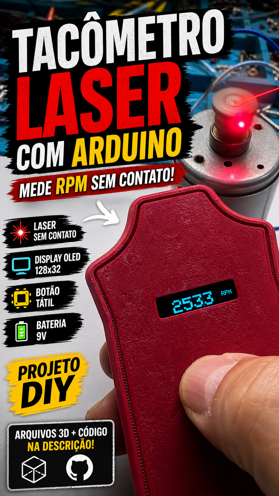

# Tacometro Digital com Arduino Pro Mini



---

### Demo em video
> Clique para assistir no YouTube

[](https://youtube.com/shorts/54jU1fzNsMc)

---

Construi um tacometro digital com Arduino para medir RPM sem contato usando sensor laser. E ideal para testar rotacao de motores, ventiladores e outros equipamentos de forma rapida e segura.

## Diferenciais

- Medicao sem contato
- Leitura de RPM em tempo real
- Projeto compacto e portatil

## Componentes

- Arduino Pro Mini
- Sensor laser
- Modulo laser
- Display OLED 128x32
- Botao tatil
- Bateria 9V

## Pinagem

| Pino | Componente |
|---|---|
| D2 | Saida do sensor laser (entrada de interrupcao) |
| D4 | RESET do display OLED |
| A4 (SDA) | Dados I2C do OLED |
| A5 (SCL) | Clock I2C do OLED |
| VCC/GND | Alimentacao dos modulos |

Observacao: o botao tatil faz parte do hardware do projeto, mas nao e utilizado no firmware atual.

## Arquivo 3D

- https://www.thingiverse.com/thing:4152617

## Como usar

1. Ligue o circuito e alinhe o sensor laser ao alvo.
2. Direcione o feixe para a area de leitura da rotacao.
3. Veja o valor de RPM no display OLED.

## Build e Upload

```bash
pio run
pio run --target upload
```
